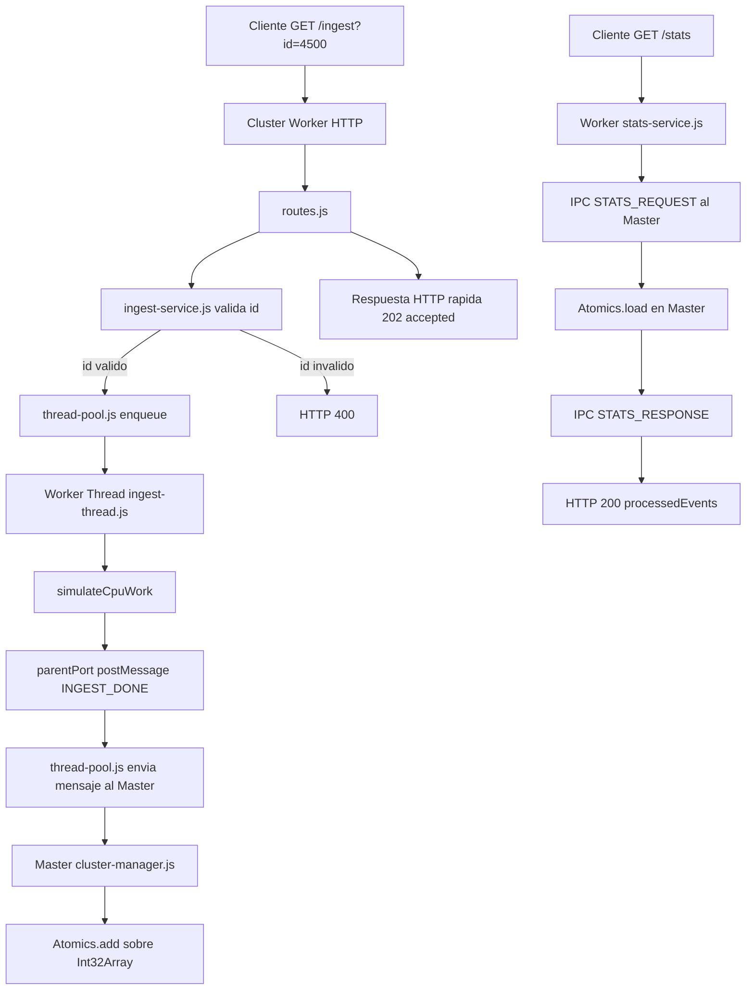

# The Guardian - Micro-Orquestador de Ingesta y Monitoreo Reactivo

## 1) Objetivo del proyecto
Construir una API HTTP resiliente y concurrente en Node.js que procese rafagas de eventos sin bloquear el Event Loop.

El proyecto demuestra:
- Escalado por procesos con Cluster.
- Procesamiento CPU-intensivo fuera del hilo principal con Worker Threads.
- Contador global de eventos procesados con SharedArrayBuffer + Atomics.
- Recuperacion automatica de workers caidos (self-healing).

## 2) Arquitectura

### Estructura de carpetas

```text
src/
|
|-- app.js
|
|-- master/
|   |-- cluster-manager.js
|
|-- worker/
|   |-- worker-process.js
|   |-- http-server.js
|   |-- routes.js
|
|-- threads/
|   |-- ingest-thread.js
|   |-- thread-pool.js
|
|-- shared/
|   |-- shared-counter.js
|   |-- constants.js
|
|-- services/
|   |-- ingest-service.js
|   |-- health-service.js
|   |-- stats-service.js
|
|-- utils/
|   |-- logger.js
|   |-- cpu-utils.js

tests/
|-- stress-test.py
```

### Capas y responsabilidades
- Master Cluster:
  - Detecta CPUs.
  - Levanta la mitad de workers.
  - Maneja self-healing ante caidas.
  - Mantiene contador global procesado.
- Worker Process:
  - Levanta servidor HTTP en puerto 8080.
  - Atiende rutas y delega negocio a servicios.
- Worker Thread:
  - Ejecuta carga CPU-intensiva por tarea de ingest.
  - Responde por parentPort.
- Servicios:
  - Validacion y reglas de negocio sin logica de transporte.
- Shared:
  - Contador atomico y constantes globales.

## 3) Diagrama de flujo



## 4) Tecnologias utilizadas
- Node.js (CommonJS)
- Modulos nativos de Node:
  - cluster
  - worker_threads
  - http
  - os
- Shared memory primitives:
  - SharedArrayBuffer
  - Atomics
- Python 3 + asyncio + aiohttp (stress test)

## 5) Como ejecutar

### Requisitos
- Node.js 18+
- Python 3.10+ (para test de carga)

### Paso a paso
1. Ir a la carpeta del proyecto.
2. Crear entorno virtual Python.
3. Instalar dependencia de pruebas.
4. Levantar API en una terminal.
5. Ejecutar stress test en otra terminal.

### Comandos

#### Terminal 1 - API
```powershell
cd C:/Users/nicop/OneDrive/Escritorio/Redes/Lab2
node src/app.js
```

#### Terminal 2 - Pruebas
```powershell
cd C:/Users/nicop/OneDrive/Escritorio/Redes/Lab2
python -m venv .venv
Set-ExecutionPolicy -Scope Process -ExecutionPolicy RemoteSigned
./.venv/Scripts/Activate.ps1
python -m pip install aiohttp
./.venv/Scripts/python.exe tests/stress-test.py
```

### Variables opcionales
```powershell
$env:PORT="8080"
$env:CPU_SIMULATION_ITERATIONS="30000000"
$env:INGEST_QUEUE_MAX_SIZE="20000"
$env:INGEST_CRASH_PROBABILITY="0.12"
node src/app.js
```

Si no defines `INGEST_CRASH_PROBABILITY`, el sistema usa `0.12` por defecto.

## 6) Como probar

### Pruebas funcionales rapidas
```powershell
Invoke-RestMethod "http://127.0.0.1:8080/health" | ConvertTo-Json -Compress
Invoke-RestMethod "http://127.0.0.1:8080/ingest?id=4500" | ConvertTo-Json -Compress
Invoke-RestMethod "http://127.0.0.1:8080/stats" | ConvertTo-Json -Compress
```

### Prueba de resiliencia (self-healing)
1. Identificar PID de un worker en logs.
2. Forzar cierre del proceso worker.
3. Verificar en logs que el Master cree reemplazo automaticamente.

Ejemplo de cierre forzado:
```powershell
Stop-Process -Id <WORKER_PID> -Force
```

### Prueba de carga
- El script tests/stress-test.py envia 500 requests concurrentes a /ingest.
- Ejecuta probes en paralelo a /health para medir latencias mientras hay carga.
- Consulta /stats y valida el delta final del contador.

## 7) Ejemplos de respuestas

### GET /health
Request:
- /health

Response 200:
```json
{
  "status": "ok",
  "pid": 34804
}
```

### GET /ingest?id=4500
Response 202:
```json
{
  "accepted": true,
  "id": 4500,
  "queueSize": 1,
  "maxQueueSize": 20000
}
```

### GET /ingest?id=abc
Response 400:
```json
{
  "error": "invalid_or_missing_id"
}
```

### GET /ingest con cola llena
Response 503:
```json
{
  "error": "ingest_queue_full",
  "queueSize": 20000,
  "maxQueueSize": 20000
}
```

### GET /stats
Response 200:
```json
{
  "processedEvents": 500
}
```

## 8) Explicacion tecnica clave

### Cluster
- El proceso primario (Master) crea workers con cluster.fork().
- Se calcula cantidad de workers como floor(CPUs * 0.5).
- Todos los workers atienden el mismo puerto.
- Si un worker muere, el Master lo detecta y crea uno nuevo.
- Se agrego control de reinicios por ventana para evitar loops de crash-restart.

### Worker Threads
- Cada worker de Cluster crea un hilo dedicado y persistente.
- El endpoint /ingest no hace calculo pesado: solo encola.
- El thread ejecuta la simulacion CPU y devuelve resultado por parentPort.

### SharedArrayBuffer y Atomics
- Se crea SharedArrayBuffer de 4 bytes y un Int32Array asociado.
- El contador se incrementa solo con Atomics.add().
- Las lecturas se hacen con Atomics.load().
- Esto evita incrementos no atomicos y condiciones de carrera en el contador.

## 9) Evidencia de cumplimiento por requisito del TP

### 1. Cluster y resiliencia
- Uso de cluster: src/app.js
- Master detecta CPUs y mitad de nucleos: src/utils/cpu-utils.js
- Fork de workers desde Master: src/master/cluster-manager.js
- Self-healing con cluster.on('exit'): src/master/cluster-manager.js
- Log de worker caido y reemplazo: src/master/cluster-manager.js

### 2. Servidor HTTP
- Workers levantan servidor HTTP en 8080: src/worker/worker-process.js
- Rutas GET /health /ingest /stats: src/worker/routes.js

### 3. /health
- Respuesta inmediata con status y pid: src/services/health-service.js

### 4. /ingest
- Valida id numerico y responde 400 si invalido: src/services/ingest-service.js
- No ejecuta CPU heavy en route/service HTTP: src/worker/routes.js, src/services/ingest-service.js
- Delega al Worker Thread: src/threads/thread-pool.js
- Respuesta rapida accepted: src/worker/routes.js

### 5. Worker Thread
- Uso de worker_threads: src/threads/ingest-thread.js
- parentPort on/postMessage: src/threads/ingest-thread.js
- Tarea CPU-intensiva configurable: src/threads/ingest-thread.js, src/shared/constants.js
- Hilo persistente por worker y recreacion en fallo: src/threads/thread-pool.js

### 6. Memoria compartida
- SharedArrayBuffer de 4 bytes: src/shared/shared-counter.js
- Int32Array: src/shared/shared-counter.js
- Atomics.add para incremento: src/shared/shared-counter.js
- Atomics.load para lectura: src/shared/shared-counter.js

### 7. /stats
- Muestra contador actual de eventos procesados: src/services/stats-service.js + src/master/cluster-manager.js

### 8. Modularizacion
- Estructura de carpetas solicitada implementada en src/ y tests/

### 9. Buenas practicas
- CommonJS en todo el codigo.
- Responsabilidades separadas por modulo.
- Manejo de errores HTTP, proceso e hilo.
- Funciones pequenas y nombres descriptivos.

### 10. Script de prueba
- asyncio + aiohttp: tests/stress-test.py
- 500 requests concurrentes a /ingest: tests/stress-test.py
- Probes paralelos a /health y latencias: tests/stress-test.py
- Consulta /stats y validacion de contador: tests/stress-test.py

## 10) Notas de evaluacion tecnica
- El sistema cumple la consigna de no bloquear el Event Loop en /ingest.
- Cumple resiliencia de cluster y recreacion automatica.
- Mantiene contador atomico de eventos procesados.
- El stress test demuestra comportamiento reactivo de /health bajo carga.

Si se desea una validacion academica mas estricta, se recomienda adjuntar capturas de logs de:
- arranque de cluster,
- reemplazo de worker caido,
- resultado final del stress test.
